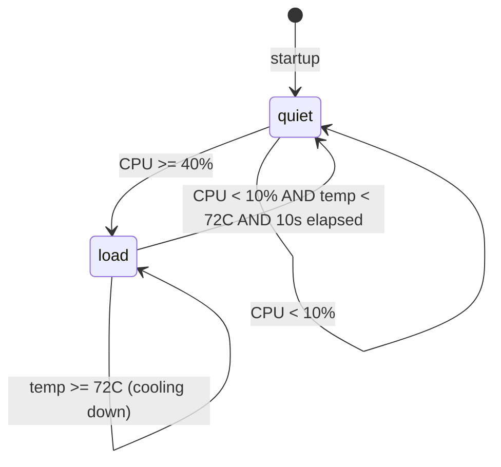
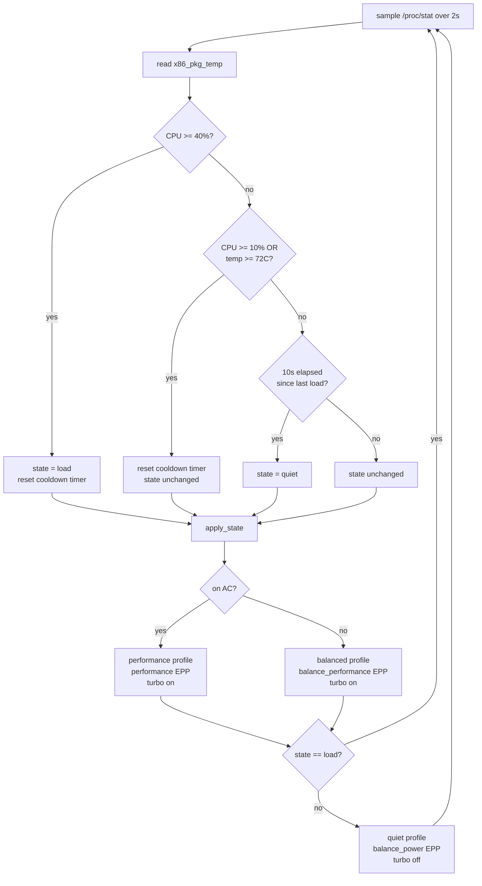

# quietcore

Dynamic CPU power management for Linux laptops with `intel_pstate`. Silent at idle, full performance under load. No manual switching.

Tested on Intel Core Ultra (Meteor Lake / Arrow Lake) but works on any laptop with `intel_pstate`, ACPI platform profiles, and TLP.

## How it works

A small daemon samples CPU utilization every 2 seconds and switches the platform profile, EPP, and turbo boost together as a unit.



**quiet state**
- Platform profile: `quiet`
- EPP: `balance_power`
- Turbo: off

**load state (on AC)**
- Platform profile: `performance`
- EPP: `performance`
- Turbo: on

**load state (on battery)**
- Platform profile: `balanced`
- EPP: `balance_performance`
- Turbo: on

### Decision loop



### Why EPP is always written (no caching)

TLP has a udev rule (`85-tlp.rules`) that fires `tlp auto` on every power supply change event. This resets EPP to TLP's configured value, overriding whatever the daemon just wrote. Caching the last-written EPP value causes the daemon to think it already applied the right setting while TLP has silently overridden it. The fix is to write EPP on every iteration. The overhead is negligible (16 sysfs writes per 2 seconds).

## Requirements

- Linux with `intel_pstate` driver in active mode
- ACPI platform profile support (`/sys/firmware/acpi/platform_profile`)
- [TLP](https://linrunner.de/tlp/) installed and enabled
- systemd

## Install

```bash
git clone https://github.com/coodos/quietcore
cd quietcore
sudo bash install.sh
```

The installer will:
1. Check requirements
2. Install the daemon to `/usr/local/bin/`
3. Install the systemd service
4. Install the TLP drop-in config to `/etc/tlp.d/`
5. Prompt you to add USB device IDs to the autosuspend denylist (keyboards, receivers, etc.)
6. Enable and start everything

## Uninstall

```bash
sudo bash install.sh uninstall
```

## Configuration

Edit `/usr/local/bin/cpu-profile-switch` to change thresholds:

```bash
CPU_HIGH=40        # % utilization to enter performance mode
CPU_LOW=10         # % utilization hysteresis - below this starts the cooldown
TEMP_THRESHOLD=72  # degrees C - sustain performance until CPU cools below this
COOLDOWN=10        # seconds below CPU_LOW AND temp threshold before going quiet
POLL=2             # seconds between samples
```

After editing, restart the service:

```bash
sudo systemctl restart cpu-profile-switch
```

### USB autosuspend denylist

TLP's autosuspend is enabled by default. Bluetooth and audio devices are excluded automatically. To protect additional devices (wireless receivers, etc.), find your device IDs with `lsusb` and add them to `USB_DENYLIST` in `/etc/tlp.d/01-quietcore.conf`:

```
USB_DENYLIST="046d:c548 3554:fa09"
```

Then reload: `sudo tlp start`

## Monitoring

```bash
while true; do
  echo "profile: $(cat /sys/firmware/acpi/platform_profile)"
  echo "turbo  : $(awk '{print ($1==0)?"on":"off"}' /sys/devices/system/cpu/intel_pstate/no_turbo)"
  echo "epp    : $(cat /sys/devices/system/cpu/cpu0/cpufreq/energy_performance_preference)"
  awk '{printf "temp   : %d C\n",$1/1000}' $(for z in /sys/class/thermal/thermal_zone*; do [[ "$(cat $z/type)" == "x86_pkg_temp" ]] && echo $z/temp && break; done)
  echo ---; sleep 1
done
```

## Files

| File | Location after install |
|------|----------------------|
| `cpu-profile-switch` | `/usr/local/bin/cpu-profile-switch` |
| `cpu-profile-switch.service` | `/etc/systemd/system/cpu-profile-switch.service` |
| `tlp-quietcore.conf` | `/etc/tlp.d/01-quietcore.conf` |
